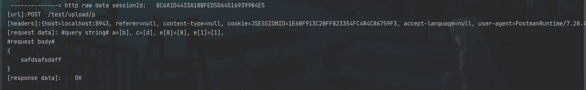

# http-raw-log

#### 介绍

打印 http 请求原始报文日志

#### 使用说明

- 引入依赖

- ```xml
  #maven#
  <dependency>
    <groupId>com.skycong</groupId>
    <artifactId>http-raw-log</artifactId>
    <version>0.9.1</version>
  </dependency>
  
  #gradle#
  dependencies {
    compile 'com.skycong:http-raw-log:0.9.1'
  }
  
  ```

- 配置可选参数，在**application.properties** 中配置以下可选参数

- ```properties
  # 由于log使用的是debug级别，使用时需要配置日志级别
  logging.level.com.skycong.httprawlog=debug
  # 是否开启 http-raw-log，默认 true
  com.skycong.http-raw.log=true
  # 拦截打印的url正则，参考 Filter UrlPatterns 格式，多个URL时使用‘,’ 分隔，默认 /*
  com.skycong.http-raw.log.urls=/*
  # URI 排除的后缀（eg： abc.html 的后缀是 html），多个URL时使用‘,’ 分隔，默认 js,css,html.
  com.skycong.http-raw.log.url.exclude-suffix=js,html,css   
  # 需要打印http-raw-log的请求头key，多个使用‘,’ 分隔，默认 content-type
  # 需要打印http-raw-log的响应头key，当且仅当不为空时才打印，多个使用‘,’ 分隔，默认 content-type
  com.skycong.http-raw.log.headers=content-type,cookie,host,accept-language,referer,user-agent
  # form data 中的数据是否需要使用utf-8重新编码，默认true
  com.skycong.http-raw.log.query-string.encode=true

  ```

- 最终效果

1. 服务启动时会打印初始化参数

   ```java
   c.s.httprawlog.autoconfig.AutoWebConfig  : init HttpRawLogFilter urls = [/*] ,log headers = [content-type, cookie, host, accept-language, referer, user-agent]
   ```

2. 发送请求时会打印如下http 请求原始日志

3. 

4. 包含了 **sessionId，requestMethod，requestURI，queryString，requestBody，responseBody**  信息
