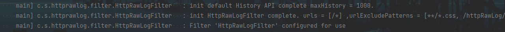
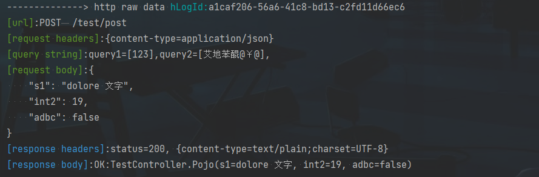
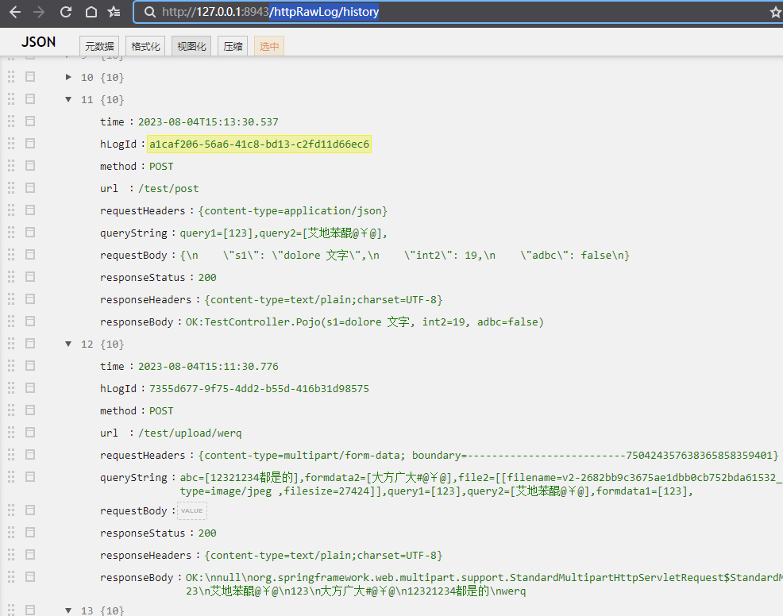

# http-raw-log

### 简介

> 打印 http 请求原始报文日志
>

### 快速接入

- #### 1 引入依赖

- ```xml
  #maven
  <dependency>
    <groupId>com.skycong</groupId>
    <artifactId>http-raw-log</artifactId>
    <version>0.9.6</version>
  </dependency>
  
  #gradle
  dependencies {
    compile 'com.skycong:http-raw-log:0.9.6'
  }
  ```
  
- #### 2 配置log level 为 debug，在**application.properties** 中配置如下一行

- ```properties
  # 由于log使用的是debug级别，使用时需要配置日志级别
  logging.level.com.skycong.httprawlog=debug
  ```
  
- #### 3 启动服务，控制台输出以下信息代表接入成功

- []()

- #### 4 此时调用接口会发现控制台输出如下日志

- []()

- #### 5 至此完成

  

---

### 其他说明

- #### 完整的配置参数

- ```properties
  # 由于log使用的是debug级别，使用时需要配置日志级别
  logging.level.com.skycong.httprawlog=debug
  # 是否开启 http-raw-log，默认 true
  com.skycong.http-raw.log=true
  # 拦截打印的url正则，参考 Filter UrlPatterns 格式，多个URL时使用‘,’ 分隔，默认 /*
  com.skycong.http-raw.log.urls=/url1/*,/test/*
  # 排除的url 路径规则：org.springframework.util.AntPathMatcher
  com.skycong.http-raw.log.url.exclude=/test/**,*.js,*.css
  # 需要打印http-raw-log的请求头key，多个使用‘,’ 分隔，默认 content-type
  com.skycong.http-raw.log.headers=content-type,cookie,host,accept-language,referer,user-agent
  # form-data 是否需要使用utf-8重新编码（0: 自动判断，1：始终需要编码，2：始终不编码）默认 0.
  com.skycong.http-raw.log.form-data.encode=0
  # 保留最近的请求历史记录，如果为0则不保留日志，也不输出到控制台，默认保留最近的1000个请求日志.
  # 访问地址：/httpRawLog/history，如有权限拦截请添加白名单
  com.skycong.http-raw.log.history=100
  ```

- #### 访问地址 **/httpRawLog/history** 可查看最近的1000个请求历史记录

- > 可使用hLogId 查询记录：/httpRawLog/history?hLogId=a1caf206-56a6-41c8-bd13-c2fd11d66ec6 

- 

  

- #### 重写 **HistoryRecord** 可自定义日志处理逻辑

- ```java
  import com.skycong.httprawlog.api.History;
  import com.skycong.httprawlog.api.HistoryRecord;
  import org.springframework.stereotype.Component;
  
  /**
   * 重写  HistoryRecord 后，默认记录最近的1000个请求历史记录接口将失效
   */
  @Component
  public class HistoryRecord2 implements HistoryRecord {
      @Override
      public void record(History history) {
          System.out.println(history);
      }
  }
  ```

- #### hLogId 说明

- > 1，客户端在请求头中写入 hLogId ，如果请求头中没有 hLogId ，服务端自动生成并写入
  >
  > 2， 服务端返回响应头中回显 hLogId ，用来追踪记录每一次请求
  >
  > 3，使用场景：调试接口时，客户端打印响应头中的 hLogId ，用来标记每一次请求出入参数