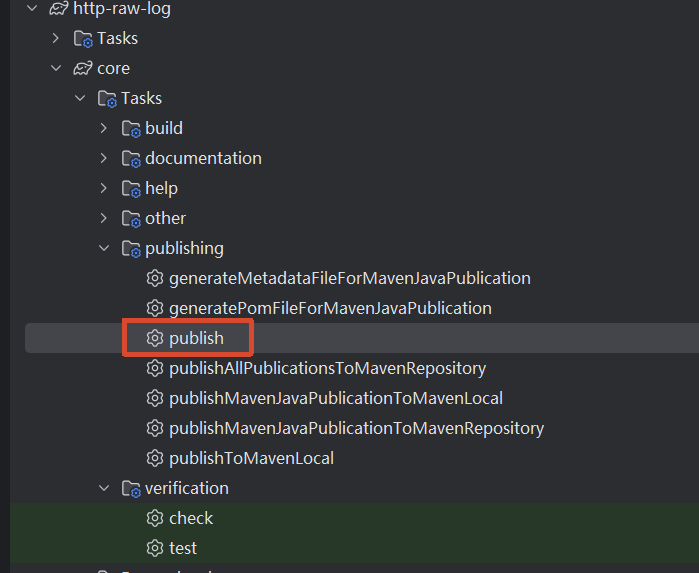
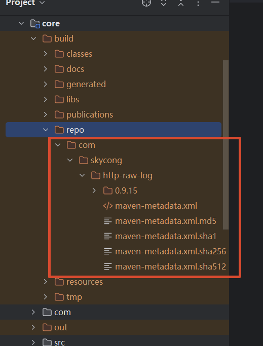
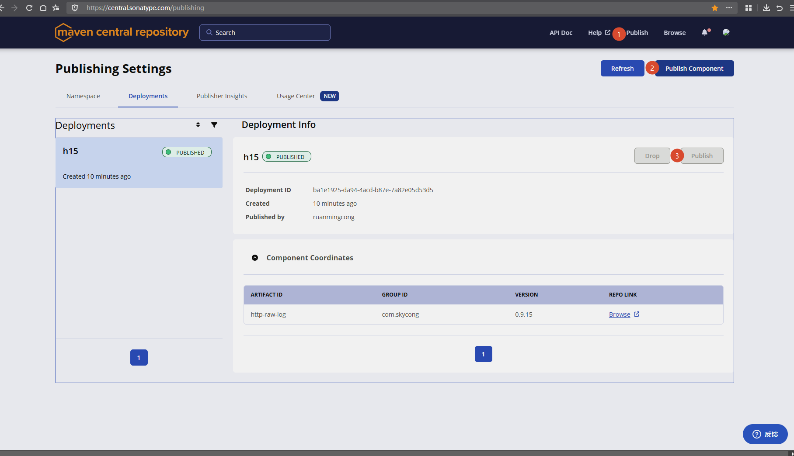
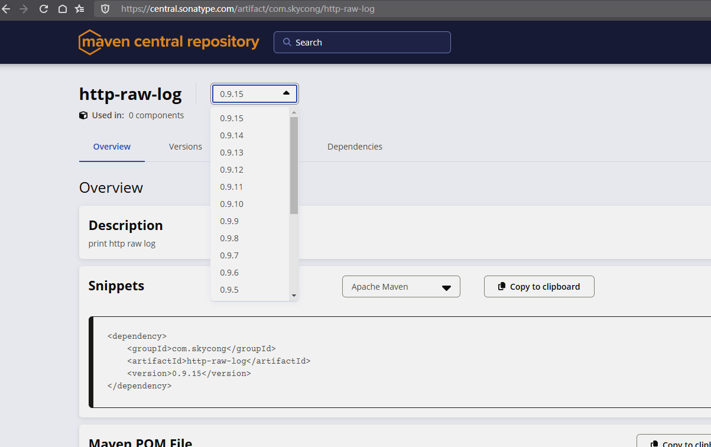

# 推送jar到Maven仓库

## 1 本地先打包

生成目标文件

将com 目录打成zip

## 2，登录Maven网站 https://central.sonatype.com/

- 点 publish
- 点 Publish Component ，选择第一步的zip上传
- 校验完成后，点 publish

## 3，全部通过后，查看最新的版本号 https://central.sonatype.com/artifact/com.skycong/http-raw-log

