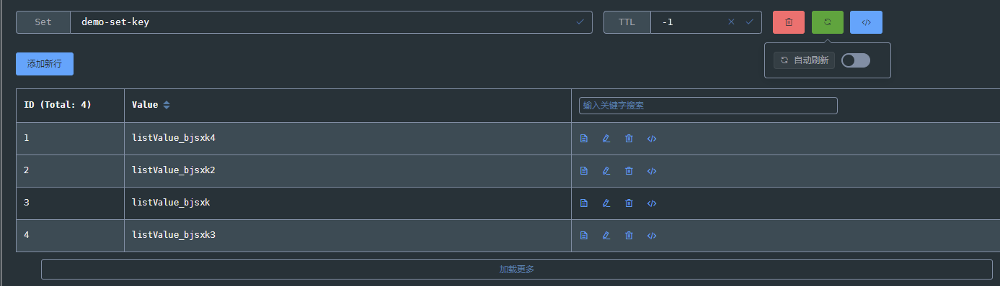

#### 

#### info

```json
GET /redisWebAdmin/info
GET /redisWebAdmin/dbInfo
```

---

#### keys

```js
# description： key搜索，支持模糊搜索和精确匹配
#request
GET /redisWebAdmin/keys?key=test&exact=false
[key]: #key 关键字
[exact]:  #是否精确匹配（true、false），默认false

#response keys list
[
  "test/dev/key",
  "test/dev/key2",
  "test/dev/key3"
]
```

---

#### get key

```js
# description： 获取key的值
#request
GET /redisWebAdmin/getKey?key=demo-string-key

#response
{
  "size": 380, # 值的所占用的字节大小，如果是集合，则是元素的个数
  "type": "string", #值的数据类型（string、list、set、zset、hash）
  "value": "value", # 依据 type 呈现不同的形式 （"string"，[list],[set],[{zset}],{map}）
  "ttl": -1 # ttl
}
```

---

#### add or update key


```js
# description： 新增或更新key
#request
POST /redisWebAdmin/addOrUpdate
content-type : application-json/charset=utf8

【type=string】
{
  "key": "141232133113211",
  "type": "string",
   // 新值   
  "newValue": "newValue_eikio"
}

【type=list】单个更新
{
  "key": "demo-list-key",
  "type": "list",
   // 新值    
  "newValue": "newValue_eikio",
   // 元素的index  
  "index": 2
}
【type=list】全量更新
{
  "key": "demo-list-key",
  "type": "list",
   // list    
  "listValue": [
    "listValue_vdjxa",
    "listValue_vdjxa2",
    "listValue_vdjxa3"
  ],
   // 全量更新标识   
  "updateAll": true
}
【type=set】单个更新
{
    "key": "demo-set-key",
    "type": "set",
    // 新值
    "newValue": "newValue_isfnk",
    // 旧值
    "oldValue": "111"
}
【type=set】全量更新
{
    "key": "demo-set-key",
    "type": "set",
    "listValue": [
        "listValue_bjsxk",
        "listValue_bjsxk2",
        "listValue_bjsxk3",
        "listValue_bjsxk4"
    ],
    "updateAll": true
}

【type=zset】单个更新
{
  "key": "demo-zset-key",
  "type": "zset",
    // 旧值
  "oldValue": "value_lvloq2",
    // 新值
  "newZset": {
    "score": 1111.0,
    "value": "value_t1d4l222"
  }
}

【type=zset】全量更新
{
  "key": "demo-zset-key",
  "type": "zset",
   // zset 集合
  "zsets": [
    {
      "score": 1.0, 
      "value": "value_lvloq"
    },
    {
      "score": 2.0,
      "value": "value_lvloq2"
    }
  ],
  "updateAll": true
}

【type=hash】单个更新
{
  "key": "demo-hash-key",
  "type": "hash",
   // 旧hash key   
  "oldValue": "old2",
   // 新hash key   
  "newValue": "old1",
   // 新hash 值   
  "hashValue": "value_t1d4啥地方撒放l222"
}

【type=hash】全量更新
{
  "key": "demo-hash-key",
  "type": "hash",
    // 新map
  "mapValue": {
    "key1": 1111.0,
    "key2": "value_t1d4l222"
  },
  "updateAll": true
}


#response
OK
```




