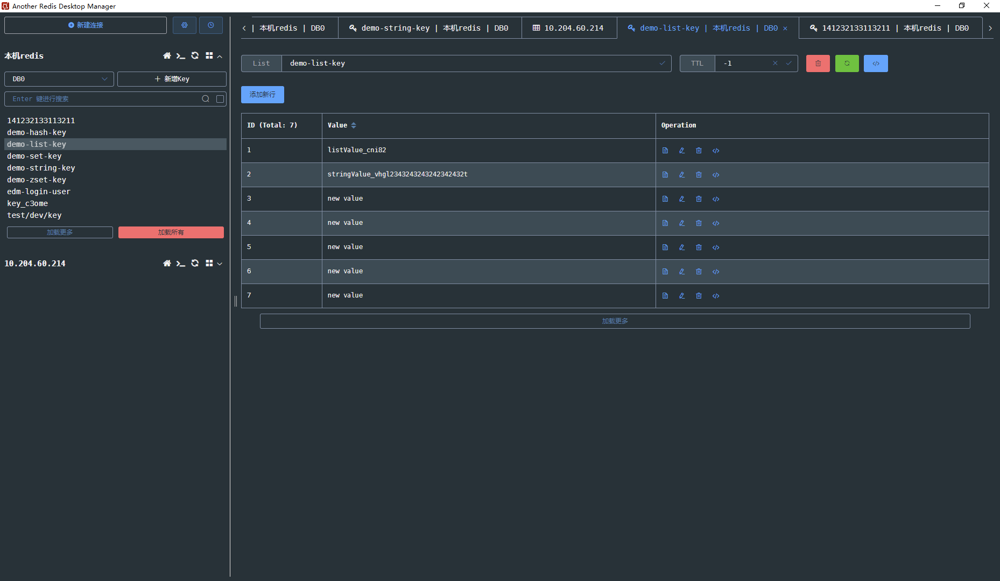

# log-record

#### 介绍

注解方式记录操作日志

#### 使用说明

- 1.引入依赖

- ```xml
  #maven#
  <dependency>
    <groupId>com.skycong</groupId>
    <artifactId>log-record</artifactId>
    <version>0.0.1</version>
  </dependency>
  
  #gradle#
  dependencies {
    implementation "com.skycong:log-record:0.0.1"
  }
  
  ```

- 2.配置可选参数，在**application.properties** 中配置以下可选参数

- ```properties
  #是否开启 LogRecordAspect，默认 true
  com.skycong.logrecord.open=true
    ```

- 3.代码配置
- ```java
   
      /**
        代码示例：test:com.skycong.httprawlog.logrecord
      * 注解中可使用方法入参中的变量，使用SpEl表达式，其中 #_ret 为方法返回对象  #_errMsg 为方法执行异常时信息
      */
      @LogRecord(value = "'现在时间是' + #user.dateTime + ',姓名:'+ #user.name + ', 年龄:'+ #user.age + '返回结果'+ #_ret + #_errMsg",
            businessType = "test",
            operateType = InternalOperateType.Add)
    @RequestMapping("test1")
    public Object test1(User user) {
        log.info("" + user);
        // throw new IllegalArgumentException("抛异常了");
        return "" + user.name;
    }
    ```

 
- 4.开启debug日志时，日志效果

   ```log
   2022-04-24 11:14:54.557 DEBUG 15228 --- [nio-8943-exec-1] c.s.logrecord.core.LogRecordAspect       : SpEl解析后的值为: LogRecordModel{value='test2现在时间是2022-04-24T11:14:54.529是间时在现2tset', operator='1650770094557', operateType='', businessType='test', businessDataId='', businessDataDetail=''}, 原始注解值: valueEl = 'test2现在时间是' + #user.dateTime + #reverseString('test2现在时间是'),operatorEl = ,businessDataIdEl = ,businessDataDetailEl = 
   ```

3. 

